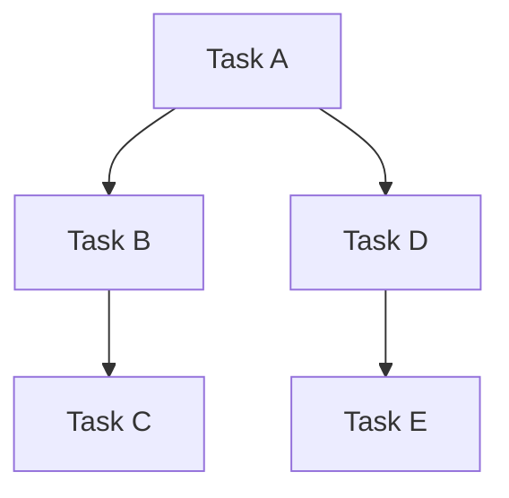
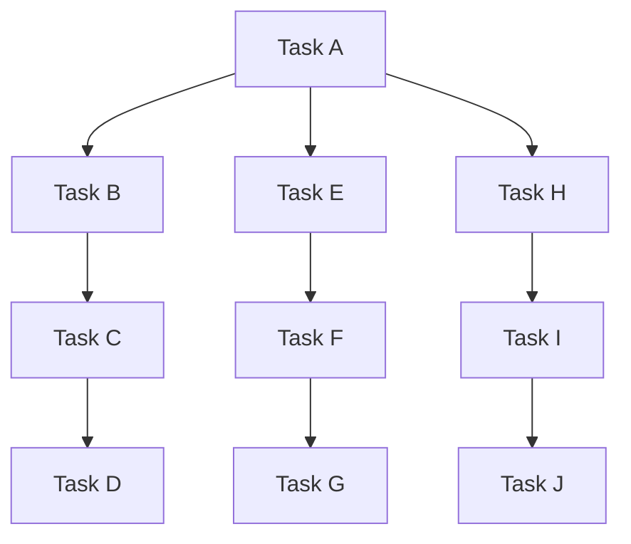
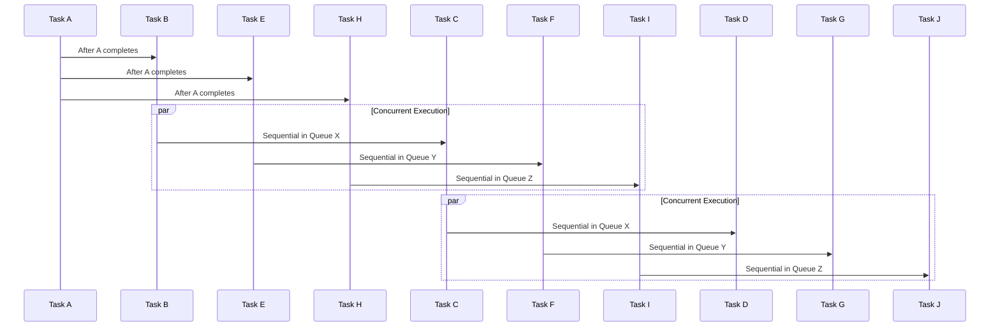
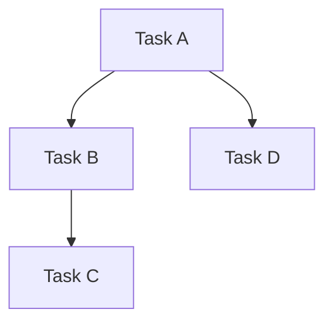
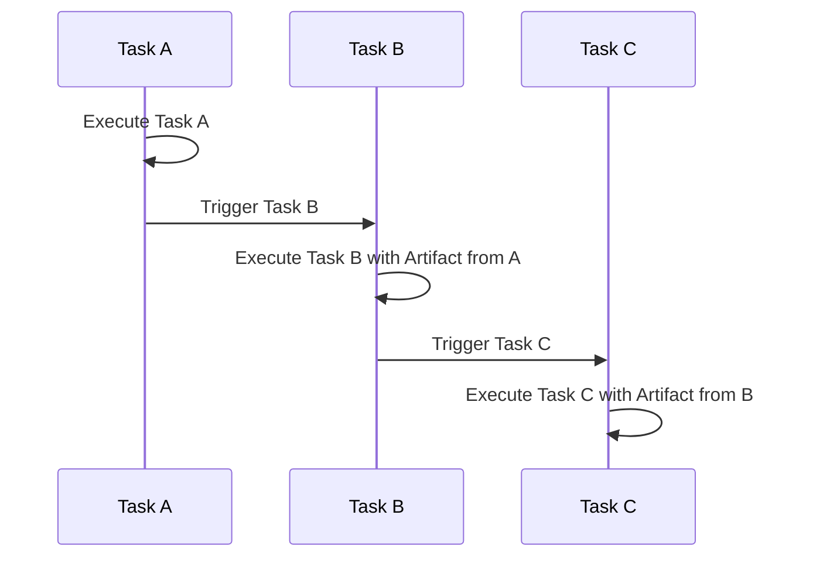
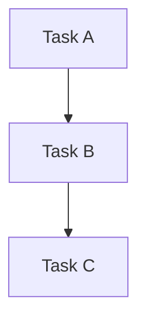

# Task Execution System: Definitions and Concepts

## Table of Contents

- [Task Execution System: Definitions and Concepts](#task-execution-system-definitions-and-concepts)
  - [Table of Contents](#table-of-contents)
  - [Introduction](#introduction)
  - [Definitions](#definitions)
    - [Task](#task)
    - [Parameters](#parameters)
    - [Action](#action)
    - [Artifact](#artifact)
  - [Types of Tasks](#types-of-tasks)
    - [Synchronous Tasks](#synchronous-tasks)
    - [Asynchronous Tasks](#asynchronous-tasks)
  - [Task Dependencies](#task-dependencies)
    - [Dependency Rules](#dependency-rules)
  - [Sequences and Layers](#sequences-and-layers)
    - [Sequence](#sequence)
    - [Layer](#layer)
    - [Queue](#queue)
    - [Dynamic Execution Across Layers](#dynamic-execution-across-layers)
  - [Diagrams](#diagrams)
    - [Task Dependency Graph](#task-dependency-graph)
    - [Concurrent Execution Flow](#concurrent-execution-flow)
- [Task Execution Algorithm and Complexity Analysis](#task-execution-algorithm-and-complexity-analysis)
  - [Algorithm Overview](#algorithm-overview)
    - [Task Representation](#task-representation)
    - [Dependency Graph Construction](#dependency-graph-construction)
    - [Execution Strategy](#execution-strategy)
  - [Algorithm Steps](#algorithm-steps)
    - [1. Identify Tasks and Dependencies](#1-identify-tasks-and-dependencies)
    - [2. Build Dependency Graph](#2-build-dependency-graph)
    - [3. Form Queues](#3-form-queues)
    - [4. Execute Tasks](#4-execute-tasks)
  - [Concurrency and Parallelism](#concurrency-and-parallelism)
    - [Concurrent Queues](#concurrent-queues)
    - [Synchronization Mechanisms](#synchronization-mechanisms)
  - [Complexity Analysis](#complexity-analysis)
    - [Time Complexity](#time-complexity)
      - [Building the Dependency Graph](#building-the-dependency-graph)
      - [Topological Sorting](#topological-sorting)
      - [Queue Formation](#queue-formation)
      - [Task Execution](#task-execution)
    - [Space Complexity](#space-complexity)
      - [Graph Storage](#graph-storage)
      - [Auxiliary Data Structures](#auxiliary-data-structures)
    - [Summary of Complexities](#summary-of-complexities)
  - [Diagrams](#diagrams-1)
    - [Execution Flow Diagram](#execution-flow-diagram)
    - [Dependency Graph Visualization](#dependency-graph-visualization)
  - [Conclusion](#conclusion)
- [Examples of Implementation](#examples-of-implementation)
  - [Components of the System](#components-of-the-system)
    - [Tasks](#tasks)
      - [Parameters](#parameters-1)
      - [Action](#action-1)
      - [Artifact](#artifact-1)
    - [Queues](#queues)
      - [FIFO Queue](#fifo-queue)
      - [LIFO Queue](#lifo-queue)
    - [Data Structures](#data-structures)
      - [Trees](#trees)
      - [Graphs](#graphs)
  - [Implementation Examples](#implementation-examples)
    - [Task Definition](#task-definition)
    - [Building the Dependency Graph](#building-the-dependency-graph-1)
    - [Queue Formation and Execution](#queue-formation-and-execution)
  - [Code Examples](#code-examples)
    - [Task Interface](#task-interface)
    - [Task Examples](#task-examples)
      - [Task A: Independent Task](#task-a-independent-task)
      - [Task B: Depends on Task A](#task-b-depends-on-task-a)
      - [Task C: Depends on Task B](#task-c-depends-on-task-b)
    - [Dependency Graph Construction](#dependency-graph-construction-1)
    - [Execution Engine](#execution-engine)
  - [Diagrams](#diagrams-2)
    - [Task Execution Flow](#task-execution-flow)
    - [Dependency Graph](#dependency-graph)
  - [Glossary](#glossary)

---

## Introduction

In modern software development, particularly within **microservices** and **asynchronous event-driven architectures**, managing tasks with complex dependencies is essential for ensuring **system efficiency** and **reliability**. Systems today often need to handle both **synchronous** and **asynchronous tasks**, which may have intricate dependency chains. Successfully managing these tasks while optimizing their execution requires a well-thought-out strategy. This document introduces the **foundational concepts** of a **task execution system** designed to handle these complexities.

The task execution system outlined in this document focuses on:
- Handling tasks with varying degrees of dependency.
- Balancing execution strategies between synchronous and asynchronous tasks.
- Ensuring tasks are executed in the correct sequence while maximizing concurrency when possible.

The subsequent sections delve deeper into the **algorithm** that drives this system. Specifically, we will explore how tasks are represented, how their dependencies are mapped and managed, and the strategies employed to optimize their execution. This includes techniques such as **queue formation**, **concurrent execution**, and how to prevent bottlenecks caused by dependent tasks.

To aid in understanding the efficiency and scalability of this task execution system, we also provide an analysis of the **algorithm's space and time complexity**. Using **asymptotic notations** and detailed calculations, the document offers insights into how the system scales with increased complexity and how efficiently it can handle large workloads.

In the latter parts of the document, we will present **practical examples** of how the task execution system can be implemented. This includes illustrations of how tasks are defined, how their dependencies are managed, and how the execution engine processes tasks through the use of queues and data structures like **trees** and **graphs**. These examples aim to lay the foundation for developing a robust library that encapsulates all the necessary functionalities for managing task execution efficiently.

---

## Definitions

### Task

A **task** is the fundamental unit of work within the system. It encapsulates a specific action to be performed and may depend on other tasks. Each task consists of three main components:

1. **Parameters** (Input Variables - Optional)
2. **Action** (Required)
3. **Artifact** (Return Value - Optional)

### Parameters

**Parameters** are the input variables that a task requires to execute. They can be:

- **Null**: Indicates that the task does not require any external inputs and is considered independent.
- **Non-null**: The presence of parameters does not necessarily imply dependency. If the parameters are global or system variables always available at execution time, the task remains independent.

**Note**: A task is considered dependent only if its parameters require artifacts produced by other tasks.

### Action

An **action** is the operation that the task performs. This is a mandatory component and defines what the task actually does. Actions can be:

- **Synchronous**: Operations that execute in sequence, such as mathematical calculations.
- **Asynchronous**: Operations that may involve waiting for external resources, like API calls or database queries.

### Artifact

An **artifact** is the output or return value produced by a task. It can be:

- **Null**: Indicates that the task does not produce a direct output. However, it might still modify shared or scoped variables.
- **Non-null**: The produced artifact can be used as a parameter for dependent tasks.

## Types of Tasks

### Synchronous Tasks

Synchronous tasks are executed in a sequential manner. Each task must complete its execution before the next one begins.

**Example**:

```typescript
function calculateSum(a: number, b: number): number {
  return a + b;
}
```

### Asynchronous Tasks

Asynchronous tasks are executed independently of the main execution flow, allowing multiple tasks to run concurrently.

**Example**:

```typescript
async function fetchUserData(userId: string): Promise<UserData> {
  const response = await fetch(`/api/users/${userId}`);
  return await response.json();
}
```

## Task Dependencies

Tasks may have dependencies based on their parameters and the variables they modify.

### Dependency Rules

A task **depends** on another task if:

1. **Artifact Dependency**: It requires the artifact (return value) produced by the parent task.
2. **Variable Dependency**: It relies on a variable that the parent task modifies.

**Independent Tasks**:

- Tasks with null parameters that do not rely on modified variables.
- Tasks with non-null parameters that are global or always available at execution time.

**Dependent Tasks**:

- Tasks that require artifacts from other tasks.
- Tasks that rely on variables modified by other tasks.

## Sequences and Layers

### Sequence

A Sequence represents a complete business logic flow, consisting of multiple Layers. It orchestrates the execution of Layers and manages the overall flow of the task execution system.

### Layer

A Layer is a group of tasks or queues that can be executed concurrently within the Sequence. Layers are determined based on the topological sorting of the dependency graph.

- Each Layer may contain multiple concurrent queues.
- Tasks within a Layer are at the same depth level in the dependency graph.
- Layers provide a logical grouping for tasks with similar dependencies and execution priorities.

### Queue

A Queue is a series of tasks within a Layer that must be executed sequentially due to their dependencies.

- Multiple Queues within a Layer can be executed concurrently.
- The number of concurrent Queues is limited by the `maxConcurrency` setting.

### Dynamic Execution Across Layers

While Layers provide a logical grouping, the execution engine allows for dynamic progression across Layers:

- If a Queue in one Layer completes before others in the same Layer, dependent tasks in subsequent Layers can begin execution immediately.
- This approach prevents bottlenecks and maximizes resource utilization.
- The system respects both the dependency graph and the `maxConcurrency` limit while allowing this flexible execution model.

## Diagrams

### Task Dependency Graph



- **Task A** is an independent task.
- **Task B** depends on **Task A**.
- **Task C** depends on **Task B**.
- **Task D** depends on **Task A**.
- **Task E** depends on **Task D**.

### Concurrent Execution Flow

After **Task A** is executed:

- **Task B** and **Task D** can be executed concurrently if they are independent of each other.
- **Task C** waits for **Task B**.
- **Task E** waits for **Task D**.

# Task Execution Algorithm and Complexity Analysis


## Algorithm Overview

### Task Representation

Each **task** is an object comprising:

- **ID**: A unique identifier.
- **Parameters**: Input variables required for execution (optional).
- **Action**: The operation or function to perform (required).
- **Artifact**: The output produced after execution (optional).
- **Dependencies**: A list of task IDs that this task depends on.

### Dependency Graph Construction

We use a **Directed Acyclic Graph (DAG)** to model task dependencies:

- **Nodes**: Represent tasks.
- **Edges**: Directed from a task to its dependent tasks.

### Execution Strategy

The execution strategy is designed to:

- **Identify Independent Tasks**: Tasks with no dependencies.
- **Form Layers and Queues**: Group tasks into Layers based on their depth in the dependency graph, and further into Queues within each Layer.
- **Enable Concurrency**: Execute independent Queues concurrently within and across Layers.
- **Ensure Correctness**: Execute tasks in an order that respects dependencies.
- **Optimize Resource Usage**: Allow dynamic execution across Layers to prevent bottlenecks.

## Algorithm Steps

### 1. Identify Tasks and Dependencies

**Input**: A list of tasks with their parameters, actions, and potential dependencies.

**Process**:

- For each task \( T_i \), analyze its parameters and variables it modifies to determine dependencies based on:
  - **Artifact Dependency**: Requires the output from another task \( T_j \).
  - **Variable Dependency**: Depends on a variable modified by another task \( T_k \).
- Create a **dependency list** for each task.

**Output**: A mapping of each task to its dependencies.

### 2. Build Dependency Graph

**Process**:

- Create nodes for all tasks.
- For each task \( T_i \):
  - For each dependency \( T_j \) in \( T_i \)'s dependency list:
    - Add a directed edge from \( T_j \) to \( T_i \).

**Result**: A **DAG** \( G = (V, E) \) representing all tasks and their dependencies, where:

- \( V \) is the set of tasks.
- \( E \) is the set of directed edges representing dependencies.

### 3. Form Queues

**Process**:

- **Topological Sorting**:
  - Perform a topological sort on the DAG to find a valid execution order.
- **Queue Identification**:
  - Traverse the DAG to identify linear paths (chains of dependent tasks).
  - Group these paths into separate **queues**.
- **Depth Levels**:
  - Assign depth levels \( d \) to tasks based on their distance from the root (tasks with no dependencies).
  - Tasks at the same depth level in different queues can be executed concurrently.

**Example**:

Consider the following DAG:



- **Queues**:
  - **Queue X**: B → C → D
  - **Queue Y**: E → F → G
  - **Queue Z**: H → I → J

### 4. Execute Tasks

**Process**:

- **Initialize Execution**:
  - Start with tasks that have no dependencies (e.g., **Task A**).
- **Sequential Execution Within Queues**:
  - Execute tasks in each queue in order.
- **Concurrent Execution of Queues**:
  - After all dependencies at a certain depth are resolved, execute tasks at the next depth level concurrently across different queues.
- **Dependency Checks**:
  - Before executing a task \( T_i \), ensure all its dependencies \( \{T_j\} \) have been completed.

**Execution Flow**:

- **Step 1**: Execute **Task A**.
- **Step 2**: Concurrently execute the first tasks in each queue (**B**, **E**, **H**).
- **Step 3**: Proceed sequentially within each queue.

## Concurrency and Parallelism

### Concurrent Queues

**Definition**: Queues containing tasks that can be executed in parallel because they do not share dependencies.

**Implementation**:

- Utilize asynchronous programming constructs (e.g., `async/await`, Promises).
- Employ task runners or job schedulers to manage execution.

### Synchronization Mechanisms

**Purpose**: To coordinate task execution and ensure that dependencies are respected.

**Techniques**:

- **Awaiting Promises**: Wait for dependent tasks to complete.
- **Event Emitters**: Trigger events upon task completion.
- **Barrier Synchronization**: Ensure that all tasks at a certain depth level complete before moving to the next level.

## Complexity Analysis

In this section, we'll provide detailed calculations for time and space complexities, using asymptotic notations to express how the algorithm scales with input size.

Let:

- \( V \) be the number of tasks (vertices in the DAG).
- \( E \) be the number of dependencies (edges in the DAG).

### Time Complexity

#### Building the Dependency Graph

- **Process**:
  - Iterate over each task to identify dependencies.
  - For each task \( T_i \), we may check all other tasks to determine dependencies based on shared variables or artifacts.

- **Worst-Case Analysis**:
  - **Dependency Identification**:
    - If dependency analysis requires comparing each task with every other task, the time complexity is \( O(V^2) \).
    - However, if dependencies are explicitly specified or can be determined in \( O(1) \) time per task, this reduces to \( O(V) \).

- **Adding Edges**:
  - For each task \( T_i \) with \( k \) dependencies, we add \( k \) edges.
  - Total number of edges \( E \) is the sum of dependencies across all tasks.

- **Total Time Complexity**:
  - **Best Case**: \( O(V) \) (if dependencies are given).
  - **Worst Case**: \( O(V^2) \) (if dependencies need to be computed via pairwise comparisons).

- **Asymptotic Notation**:
  - The time complexity for building the graph is \( O(V + E) \) when dependencies are given.
  - If dependencies need to be computed, it may be up to \( O(V^2) \).

#### Topological Sorting

- **Algorithm Used**: Kahn's Algorithm or Depth-First Search (DFS)-based topological sort.

- **Time Complexity**:
  - Kahn's Algorithm:
    - Initialize in-degree for each vertex: \( O(V) \).
    - Process vertices:
      - Each vertex is enqueued and dequeued exactly once: \( O(V) \).
      - For each edge, we adjust in-degrees: \( O(E) \).

  - **Total Time Complexity**:
    - \( O(V + E) \).

- **Asymptotic Notation**:
  - \( O(V + E) \).

#### Queue Formation

- **Process**:
  - After topological sorting, tasks are grouped into queues based on their dependencies.

- **Time Complexity**:
  - Assigning depth levels:
    - Traverse each task and its dependencies to assign depth levels: \( O(V + E) \).
  - Grouping tasks into queues:
    - Iterate over tasks and place them into appropriate queues based on depth: \( O(V) \).

- **Total Time Complexity**:
  - \( O(V + E) \).

#### Task Execution

- **Sequential Tasks within Queues**:
  - Time depends on individual task execution times.
  - Let \( T_{seq} = \sum_{i=1}^{n} t_i \) for tasks in a queue, where \( t_i \) is the execution time of task \( T_i \).

- **Concurrent Queues**:
  - Total execution time is determined by the longest queue (critical path).

- **Overall Execution Time**:
  - **Dependent on Task Durations**.
  - **Asymptotic Notation**:
    - If all tasks take constant time \( O(1) \), and the longest queue has length \( L \), total time is \( O(L) \).

### Space Complexity

#### Graph Storage

- **Nodes**:
  - Store \( V \) nodes: \( O(V) \).

- **Edges**:
  - Each edge represents a dependency.
  - Store \( E \) edges: \( O(E) \).

- **Adjacency List Representation**:
  - For each node, store a list of outgoing edges (dependencies).
  - Total space: \( O(V + E) \).

#### Auxiliary Data Structures

- **In-degree Array** (for Kahn's Algorithm):
  - Stores in-degree for each node: \( O(V) \).

- **Queue for Topological Sort**:
  - Maximum size is \( O(V) \).

- **Depth Levels Mapping**:
  - Stores depth level for each task: \( O(V) \).

- **Visited Set or Stack** (for DFS):
  - Maximum size is \( O(V) \).

- **Total Space Complexity**:
  - \( O(V + E) \).

### Summary of Complexities

- **Time Complexity**:
  - **Building Dependency Graph**: \( O(V + E) \) when dependencies are given; up to \( O(V^2) \) if dependencies need to be computed.
  - **Topological Sorting**: \( O(V + E) \).
  - **Queue Formation**: \( O(V + E) \).
  - **Task Execution**: Dependent on task durations; critical path length \( L \).

- **Space Complexity**:
  - \( O(V + E) \).

## Diagrams

### Execution Flow Diagram



### Dependency Graph Visualization

Refer to the DAG in the [Form Queues](#3-form-queues) section.

## Conclusion

The proposed algorithm efficiently executes tasks by respecting dependencies and maximizing concurrency where possible. By constructing a dependency graph and forming queues, we can identify opportunities for parallel execution, reducing total execution time. The time complexity of the algorithm is linear with respect to the number of tasks and dependencies when dependencies are explicitly provided. The space complexity is also linear, making the algorithm suitable for large-scale systems.

# Examples of Implementation


## Components of the System

### Tasks

A **task** in our system is a fundamental unit of work. Each task is composed of:

1. **Parameters**: Input variables required for execution (optional).
2. **Action**: The operation or function to perform (required).
3. **Artifact**: The output produced after execution (optional).

#### Parameters

- **Independent Task**: A task with no parameters or parameters that are globally available.
- **Dependent Task**: A task whose parameters depend on artifacts produced by other tasks or variables modified by other tasks.

**Example Parameters**:

- **Independent**: `configSettings`, which are globally accessible.
- **Dependent**: `dataFromTaskA`, which is the artifact produced by `Task A`.

#### Action

The **action** is the core functionality of the task. It can be synchronous or asynchronous.

**Examples**:

- **Synchronous Action**: Calculating the sum of two numbers.
- **Asynchronous Action**: Fetching data from an API.

#### Artifact

An **artifact** is the result produced by the task, which can be used by other tasks.

**Examples**:

- **Data Object**: A JSON object retrieved from an API.
- **Computed Value**: The result of a mathematical calculation.

### Queues

Queues are used to manage task execution order.

#### FIFO Queue

- **First-In-First-Out**: Tasks are executed in the order they are added.
- **Use Case**: When task order is critical and must be preserved.

#### LIFO Queue

- **Last-In-First-Out**: The most recently added task is executed first.
- **Use Case**: Situations requiring the most recent task to be executed immediately.

### Data Structures

#### Trees

- **Definition**: A hierarchical data structure with nodes connected by edges.
- **Use in Task System**: Representing tasks and their dependencies in a parent-child relationship.

#### Graphs

- **Definition**: A set of nodes connected by edges, possibly forming cycles.
- **Directed Acyclic Graph (DAG)**: A graph with directed edges and no cycles, used to represent task dependencies.

## Implementation Examples

### Task Definition

**TypeScript Interface**:

```typescript
interface Task {
  id: string;
  parameters?: any;
  action: () => Promise<any> | any;
  artifact?: any;
  dependencies?: string[];
}
```

### Building the Dependency Graph

We construct a DAG to represent task dependencies.

**Example**:

- **Tasks**:
  - **Task A**: Independent task.
  - **Task B**: Depends on **Task A**.
  - **Task C**: Depends on **Task B**.
  - **Task D**: Depends on **Task A**.

**Visualization**:



### Queue Formation and Execution

- **Queues**:
  - **Queue 1**: A → B → C
  - **Queue 2**: A → D

- **Execution Strategy**:
  - Execute **Task A**.
  - Concurrently execute **Task B** and **Task D**.
  - Execute **Task C** after **Task B** completes.

## Code Examples

### Task Interface

```typescript
interface Task {
  id: string;
  parameters?: any;
  action: () => Promise<any> | any;
  artifact?: any;
  dependencies?: string[];
}
```

### Task Examples

#### Task A: Independent Task

```typescript
const taskA: Task = {
  id: "A",
  action: () => {
    console.log("Executing Task A");
    return "Result from Task A";
  },
};
```

#### Task B: Depends on Task A

```typescript
const taskB: Task = {
  id: "B",
  dependencies: ["A"],
  action: (artifactFromA: any) => {
    console.log("Executing Task B with", artifactFromA);
    return `Result from Task B using ${artifactFromA}`;
  },
};
```

#### Task C: Depends on Task B

```typescript
const taskC: Task = {
  id: "C",
  dependencies: ["B"],
  action: (artifactFromB: any) => {
    console.log("Executing Task C with", artifactFromB);
    return `Result from Task C using ${artifactFromB}`;
  },
};
```

### Dependency Graph Construction

```typescript
const tasks: Task[] = [taskA, taskB, taskC];

const taskMap = new Map<string, Task>();
tasks.forEach((task) => taskMap.set(task.id, task));

const adjacencyList = new Map<string, string[]>();

tasks.forEach((task) => {
  if (!adjacencyList.has(task.id)) {
    adjacencyList.set(task.id, []);
  }
  if (task.dependencies) {
    task.dependencies.forEach((dep) => {
      if (!adjacencyList.has(dep)) {
        adjacencyList.set(dep, []);
      }
      adjacencyList.get(dep)!.push(task.id);
    });
  }
});
```

### Execution Engine

```typescript
async function executeTasks(tasks: Task[]) {
  const executed = new Set<string>();

  async function executeTask(taskId: string): Promise<any> {
    if (executed.has(taskId)) return;

    const task = taskMap.get(taskId)!;

    // Execute dependencies first
    if (task.dependencies) {
      for (const depId of task.dependencies) {
        await executeTask(depId);
      }
    }

    // Prepare parameters if needed
    let params = undefined;
    if (task.dependencies && task.dependencies.length > 0) {
      params = task.dependencies.map((depId) => taskMap.get(depId)!.artifact);
    }

    // Execute the task action
    const result = await task.action(...(params || []));
    task.artifact = result;
    executed.add(taskId);
  }

  // Start execution from tasks with no dependencies
  for (const task of tasks) {
    await executeTask(task.id);
  }
}

// Run the execution engine
executeTasks(tasks).then(() => {
  console.log("All tasks executed.");
});
```

**Explanation**:

- **executeTasks**: Orchestrates the execution of all tasks.
- **executeTask**: Recursively executes a task and its dependencies.
- **executed**: A set to keep track of completed tasks to avoid redundant executions.

## Diagrams

### Task Execution Flow



### Dependency Graph



## Glossary

- **Action**: The operation performed by a task, defining its core functionality.
- **Artifact**: The output or result produced by a task, which can be used as input for dependent tasks.
- **Asynchronous Task**: A task that runs independently, allowing other tasks to execute concurrently without waiting for its completion.
- **Asymptotic Notation**: Mathematical notation used to describe the limiting behavior of a function as its input size grows, commonly used in algorithm analysis (e.g., \( O(n) \), \( \Theta(n) \), \( \Omega(n) \)).
- **Barrier Synchronization**: A method to block or synchronize tasks until certain conditions are met, ensuring that all dependent tasks reach a specific point before continuing execution.
- **Concurrency**: The ability to execute multiple tasks simultaneously, often used to improve performance by leveraging parallelism in systems with independent tasks.
- **Critical Path**: The longest sequence of dependent tasks that determines the minimum completion time for the entire process or system. Any delay along the critical path directly affects the overall completion time.
- **Dependency**: A relationship between tasks where one task requires input (parameters or artifacts) or variables modified by another task to execute successfully.
- **Directed Acyclic Graph (DAG)**: A graph with directed edges and no cycles, typically used to represent task dependencies. In a DAG, nodes represent tasks, and directed edges represent the dependencies between them.
- **Parameter**: Input variables required for a task's execution. Parameters can either be globally available, making the task independent, or provided by other tasks, making the task dependent.
- **Synchronous Task**: A task that executes in sequence within the main execution flow, waiting for each previous task to complete before moving to the next.
- **Task**: A unit of work consisting of parameters, an action, and optionally an artifact (output) that may be used by other tasks in the system.
- **Topological Sort**: An ordering of the nodes in a Directed Acyclic Graph (DAG) such that for every directed edge \( u \rightarrow v \), node \( u \) appears before node \( v \). This ensures that tasks are executed in a sequence that respects their dependencies.
